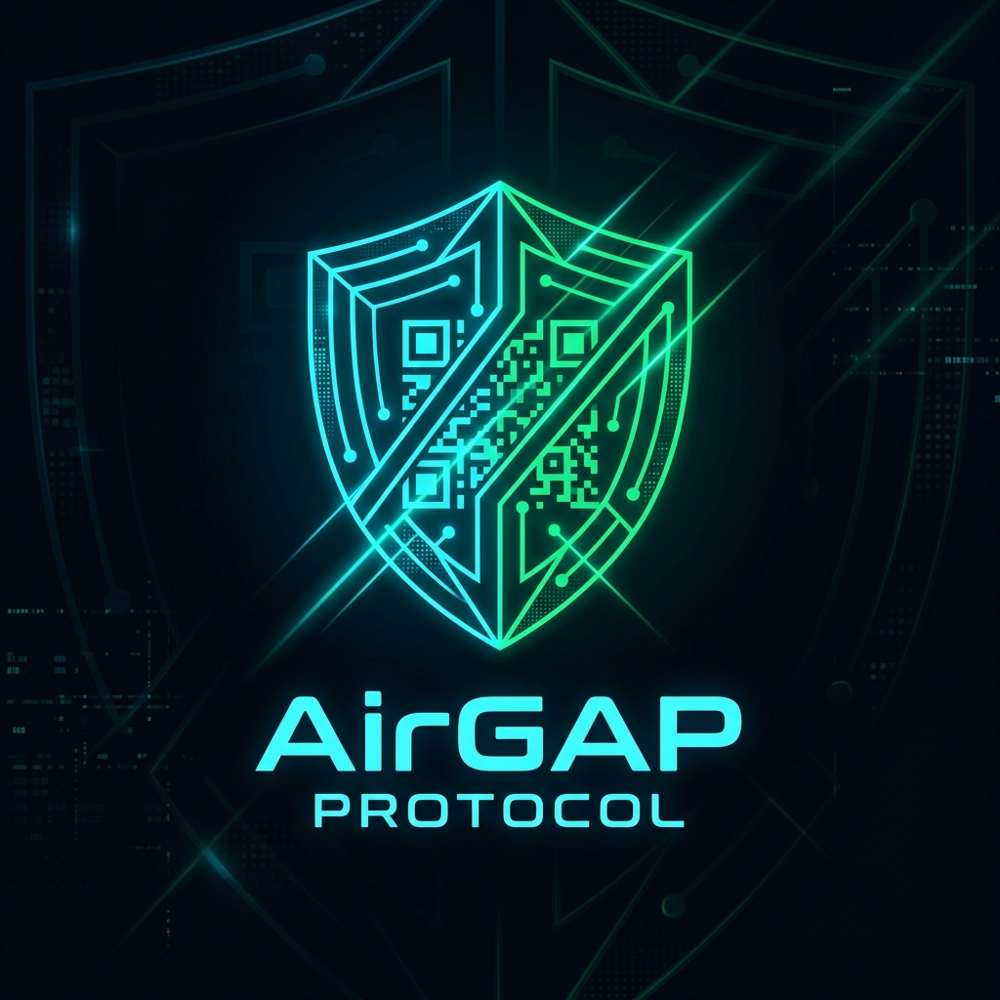

<p align="center">
  
</p>

# 📡 AirGap Protocol (`OPTX-v2`)

[](https://gui100000.github.io/airgap-protocol/)
[](https://github.com/Gui100000/airgap-protocol/actions/workflows/ci.yml)
[](./LICENSE)
[-ff007f?style=for-the-badge)](#zero-network-threat-model)
[-ffb703?style=for-the-badge)](#mathematical-foundation)
[](#progressive-web-app-architecture)

> **Zero-Network, 100% Client-Side Optical Data Bridge.**  
> Transmit arbitrary binary files across physically isolated, air-gapped computers, smartphones, and tablets via animated high-speed QR streams using **Systematic Fountain Codes (Luby Transform & RaptorQ principles over $\text{GF}(2)$)**.

---

## 🌐 Live Web Application

🚀 **Instant Access (No Installation Required):**  
👉 **[https://gui100000.github.io/airgap-protocol/](https://gui100000.github.io/airgap-protocol/)**

*Once loaded for the first time, the application installs a Cache-First Service Worker and operates **100% offline**, even with Wi-Fi, Ethernet, and Cellular Data permanently disabled.*

---

## ⚡ The Problem: Why Optical Air-Gap?

In high-security, defense, cryptocurrency, and confidential computing environments, systems are physically disconnected from local networks and the internet (**Air-Gapped**). 

| Transfer Method | Security Vulnerabilities & Limitations |
| :--- | :--- |
| ❌ **USB Flash Drives (Sneakernet)** | BadUSB firmware attacks, malware propagation (Stuxnet), hardware damage, air-gap bridging. |
| ❌ **Bluetooth / Wi-Fi / NFC** | Radio-frequency eavesdropping, pairing exploits, hardware authorization leaks. |
| ❌ **Standard Sequential QR Codes** | Missing a single frame freezes transmission; sender must manually repeat lost chunks. |
| ✅ **AirGap Protocol (`OPTX-v2`)** | **100% Unidirectional Optical Channel (Screen $\to$ Camera)**. Rateless fountain codes reconstruct files in any packet order with mathematical $\text{GF}(2)$ Gaussian Elimination. |

---

## 🔬 Mathematical Foundation

AirGap Protocol implements **Systematic Rateless Fountain Codes** over the Galois Field of order 2 ($\text{GF}(2)$).

```
   [ Source File: B Bytes ]
             │
      (Deflate-Raw Stream)
             │
             ▼
   [ Sliced into K Source Blocks: S_0, S_1, ..., S_{K-1} ]
             │
   ┌─────────┴─────────────────────────────────────────┐
   │                                                   │
   ▼ (Packets 0 .. K-1)                                ▼ (Packets K .. ∞)
[ Systematic Droplets ]                       [ Soliton Fountain Repair ]
Raw Source Data S_i                           Linear Combinations:
(Direct 1-to-1 Ingestion)                     R_j = S_{i_1} ⊕ S_{i_2} ⊕ ... ⊕ S_{i_d}
                                              where d ~ μ(d) (Robust Soliton Dist)
```

### 1. Robust Soliton Degree Distribution $\mu(d)$
Repair packets sample degrees $d \in \{1, 2, \dots, K\}$ using an in-memory deterministic `SplitMix32` PRNG seeded by the packet index:

$$\mu(d) = \begin{cases} \frac{1}{K} & d = 1 \\ \frac{1}{d(d-1)} & d = 2, \dots, K \end{cases}$$

$$\tau(d) = \begin{cases} \frac{S}{K \cdot d} & d = 1, \dots, \frac{K}{R}-1 \\ \frac{S \cdot \ln(S / \delta)}{K} & d = \frac{K}{R} \\ 0 & \text{otherwise} \end{cases}, \quad \text{where } S = c \cdot \ln(K / \delta) \sqrt{K}$$

$$\mu_{\text{robust}}(d) = \frac{\mu(d) + \tau(d)}{\sum_{i=1}^K (\mu(i) + \tau(i))}$$

### 2. Fast GF(2) Row Reduction Solver
The receiver runs a dedicated multi-threaded Web Worker that constructs an augmented binary matrix $[G \mid Y]$:
- **Peeling Decoder (Belief Propagation)**: Solves degree-1 ripples in $\mathcal{O}(K)$ time.
- **Incremental Gaussian Elimination**: Vectorized 64-bit XOR operations (`BigUint64Array`) reduce non-singleton rows into upper-triangular echelon form to resolve bursts of lost packets.

---

## 📦 Wire Specification (`OPTX-v2`)

Each optical QR frame encapsulates a **20-Byte Little-Endian Binary Header** followed by raw payload bytes:

```
 0                   1                   2                   3
 0 1 2 3 4 5 6 7 8 9 0 1 2 3 4 5 6 7 8 9 0 1 2 3 4 5 6 7 8 9 0 1
+-+-+-+-+-+-+-+-+-+-+-+-+-+-+-+-+-+-+-+-+-+-+-+-+-+-+-+-+-+-+-+-+
|          Magic 'OP'           |    Version    |     Flags     |
+-+-+-+-+-+-+-+-+-+-+-+-+-+-+-+-+-+-+-+-+-+-+-+-+-+-+-+-+-+-+-+-+
|                          Session ID                           |
+-+-+-+-+-+-+-+-+-+-+-+-+-+-+-+-+-+-+-+-+-+-+-+-+-+-+-+-+-+-+-+-+
|                        Packet Sequence                        |
+-+-+-+-+-+-+-+-+-+-+-+-+-+-+-+-+-+-+-+-+-+-+-+-+-+-+-+-+-+-+-+-+
|                     Total Source Blocks (K)                   |
+-+-+-+-+-+-+-+-+-+-+-+-+-+-+-+-+-+-+-+-+-+-+-+-+-+-+-+-+-+-+-+-+
|                        Payload Length                         |
+-+-+-+-+-+-+-+-+-+-+-+-+-+-+-+-+-+-+-+-+-+-+-+-+-+-+-+-+-+-+-+-+
|                        Payload Data...                        |
+-+-+-+-+-+-+-+-+-+-+-+-+-+-+-+-+-+-+-+-+-+-+-+-+-+-+-+-+-+-+-+-+
```

| Byte Offset | Field | Type | Description |
| :--- | :--- | :--- | :--- |
| `0x00 - 0x01` | **Magic Identifier** | `Uint16` (`0x504F`) | ASCII `"OP"` wire identifier. |
| `0x02` | **Protocol Version** | `Uint8` (`0x02`) | Protocol specification version (`OPTX-v2`). |
| `0x03` | **Bitwise Flags** | `Uint8` | `0x01`: Systematic, `0x02`: Compressed, `0x04`: Manifest. |
| `0x04 - 0x07` | **Session ID** | `Uint32` | Truncated Murmur/CRC hash of the source payload SHA-256. |
| `0x08 - 0x0B` | **Packet Sequence** | `Uint32` | Frame index ($0 \dots K-1$ = Source, $\ge K$ = Fountain Repair). |
| `0x0C - 0x0F` | **Total Blocks (K)** | `Uint32` | Number of systematic source blocks required for recovery. |
| `0x10 - 0x13` | **Payload Length** | `Uint32` | Byte length of the optical payload in this QR frame. |
| `0x14 - End` | **Payload Stream** | `Uint8Array` | Binary payload data (raw or linear $\text{GF}(2)$ XOR combination). |

---

## 🛠️ Feature Matrix

### 📡 Transmitter (TX)
- **Multi-File Ingestion**: Drag & drop multiple files simultaneously into an in-memory SHA-256 verified archive bundle.
- **Granular Density & ECC**: Select payload densities (180 B to 768 B) and Reed-Solomon Error Correction (L, M, Q, H).
- **Interactive Live Preview**: Real-time test pattern QR visualizer reacts dynamically to tuning controls before file selection.
- **Direct Clipboard Paste**: Press `Ctrl+V` (or `Cmd+V`) anywhere to transmit copied text, secrets, or images instantly.
- **Screen Wake Lock**: Automatically prevents mobile devices from sleeping during transmission.

### 📷 Receiver (RX)
- **Dual-Engine Optical Scanner**: Hardware-accelerated native `BarcodeDetector` with pure JS fallback.
- **Live Fountain Constellation HUD**: Visualizes systematic vs fountain recovery progress across the $\text{GF}(2)$ matrix grid.
- **Cryptographic Verification**: Recomputed SHA-256 digest guarantees bit-exact payload restoration.
- **Snapshot Upload Fallback**: Decodes captured photos and frames if real-time video is unavailable.

### 🧰 Air-Gapped Utility Suite
- **Smart File Splitter**: Slice large files by part size (KB/MB) or into exactly $N$ equal parts ($1 \dots 100$).
- **1-Click ZIP Packaging**: Zero-dependency pure-JS in-memory ZIP bundler exports all part files in a single download without browser multi-file permission prompts.
- **File Part Merger**: Recombines `.part1`, `.part2`, ... slices up to 100 parts into the original bitstream.
- **Image Size Optimizer**: Re-encodes high-res images to WebP/JPEG locally with integer quality control (10–100%).

---

## 🔒 Zero-Network Threat Model

```
┌────────────────────────────────────────────────────────┐
│               BROWSER CLIENT SANDBOX                   │
│                                                        │
│  [ Web Worker: Encoder ]    [ Web Worker: Decoder ]   │
│            ▲                           ▲               │
│            │                           │               │
│  [ UI State Machine ] ──► [ In-Memory Memory Cache ]   │
│                                                        │
│  CSP Policy: connect-src 'none' (Zero Cloud / No CDN)  │
└────────────────────────────────────────────────────────┘
                       ╳ NO TRAFFIC
         [ External Internet / Cloud APIs ]
```

1. **Strict Content Security Policy (CSP)**: `connect-src 'none';` completely blocks `fetch()`, `XMLHttpRequest`, `WebSocket`, and `EventSource`.
2. **Metadata Privacy Timestamps**: System logs start at session-relative second zero (`T+00:00.0`) without leaking system clock or timezones.
3. **No External CDNs**: All scripts, fonts, and stylesheets are bundled locally within the repository.

---

## 🚀 Local Deployment & Development

No build tools, npm packages, or external bundlers required.

```bash
# 1. Clone the repository
git clone https://github.com/Gui100000/airgap-protocol.git
cd airgap-protocol

# 2. Run the verification test suites
node tests/test-fountain.js
node tests/test-qr.js

# 3. Serve locally (optional dual HTTP/HTTPS server)
node server.js
```

---

## ⚖️ License

Distributed under the **MIT License**. See [`LICENSE`](./LICENSE) for full details.
